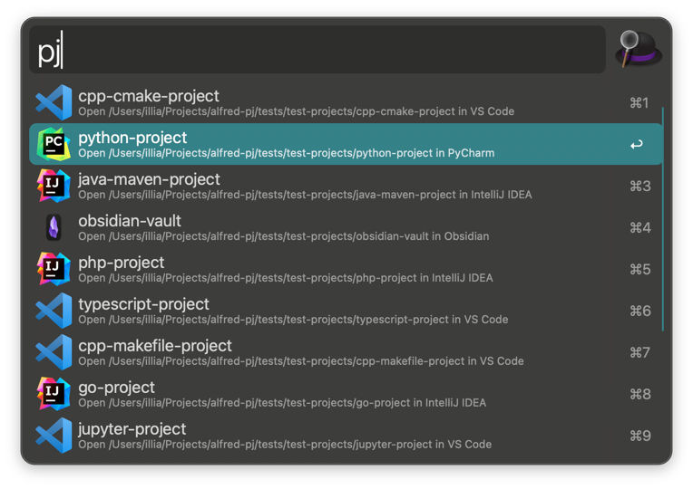

# PJ Alfred Workflow

Alfred workflow to quickly open projects in the appropriate editor, terminal, or Finder.

Inspired by Oh-My-ZSH's [pj plugin](https://github.com/ohmyzsh/ohmyzsh/tree/master/plugins/pj).

## Screenshot



## Features

- **Smart editor detection** - Automatically opens projects in the right editor based on project type
- **Multiple project directories** - Scan multiple directories for projects
- **Customizable editors** - Configure preferred editors per language
- **Keyboard shortcuts** - Quickly open in terminal, Finder, VS Code, or GitHub
- **Usage tracking** - Frequently used projects appear first

## Requirements

- macOS
- [Alfred](https://www.alfredapp.com/) with Powerpack

## Installation

1. Download the latest `.alfredworkflow` file from [GitHub Releases](https://github.com/igrybkov/alfred-pj/releases)
2. Double-click to install in Alfred
3. Configure your project directories (see [Configuration](#configuration))

## Usage

Invoke Alfred and type `pj` to see your projects.

### Keyboard Shortcuts

| Modifier | Action |
|----------|--------|
| _(none)_ | Open in detected editor |
| ⌥ Option | Open in VS Code |
| ⌃ Control | Open GitHub page |
| ⇧ Shift | Open in Finder |
| ⌘ Command | Open in terminal |

## Configuration

Open Alfred Preferences → Workflows → PJ → Configure Workflow (top right).

### Project Paths

Set the `paths` variable to a comma-separated list of directories to scan:

```
~/Projects,~/Work,~/Personal
```

### Editor Preferences

Configure your preferred editors using environment variables. Editors are comma-separated, and the first available one is used.

| Variable | Project Type | Default |
|----------|--------------|---------|
| `DEFAULT_EDITOR` | Fallback for unknown types | `code` |
| `EDITORS_PYTHON` | Python projects | `pycharm,idea,code` |
| `EDITORS_JAVASCRIPT` | JavaScript projects | `webstorm,phpstorm,idea,code` |
| `EDITORS_TYPESCRIPT` | TypeScript projects | `webstorm,code` |
| `EDITORS_GO` | Go projects | `goland,idea,code` |
| `EDITORS_RUST` | Rust projects | `rustrover,idea,code` |
| `EDITORS_JAVA` | Java projects | `idea` |
| `EDITORS_PHP` | PHP projects | `phpstorm,idea,code` |
| `EDITORS_RUBY` | Ruby projects | `rubymine,code` |
| `EDITORS_CPP` | C/C++ projects | `clion,code` |
| `EDITORS_JUPYTER` | Jupyter notebooks | `pycharm,idea,code` |

## Editor Detection

The workflow detects project types by looking for specific files and directories:

| Project Type | Detection | Default Editor |
|--------------|-----------|----------------|
| Obsidian vault | `.obsidian/` directory | Obsidian |
| VS Code project | `.vscode/` (without `.idea/`) | VS Code |
| Java | `pom.xml`, `build.gradle` | IntelliJ IDEA |
| PHP | `composer.json`, `*.php` | PHPStorm |
| Python | `pyproject.toml`, `requirements.txt`, `.venv/` | PyCharm |
| TypeScript | `tsconfig.json` | WebStorm |
| JavaScript | `package.json`, `*.js` | WebStorm |
| Go | `go.mod`, `*.go` | GoLand |
| Rust | `Cargo.toml`, `*.rs` | RustRover |
| Ruby | `Gemfile`, `*.rb` | RubyMine |
| C/C++ | `CMakeLists.txt`, `Makefile` | CLion |

Detection order matters - the first match wins.

## Development

```bash
# Link workflow to Alfred for development
python bin/release.py link

# Unlink workflow from Alfred
python bin/release.py unlink

# Package into .alfredworkflow file
python bin/release.py package

# Get or set version
python bin/release.py version          # show current
python bin/release.py version 1.2.3    # set specific
python bin/release.py version patch    # bump patch/minor/major

# Create a release (bumps version, creates tag, pushes to GitHub)
python bin/release.py release patch    # or: minor, major

# Run tests
uv run pytest
```

## Contributing

Pull requests are welcome. For major changes, please open an issue first to discuss what you would like to change.

## License

This project is licensed under the MIT License - see the `LICENSE` file for details.
